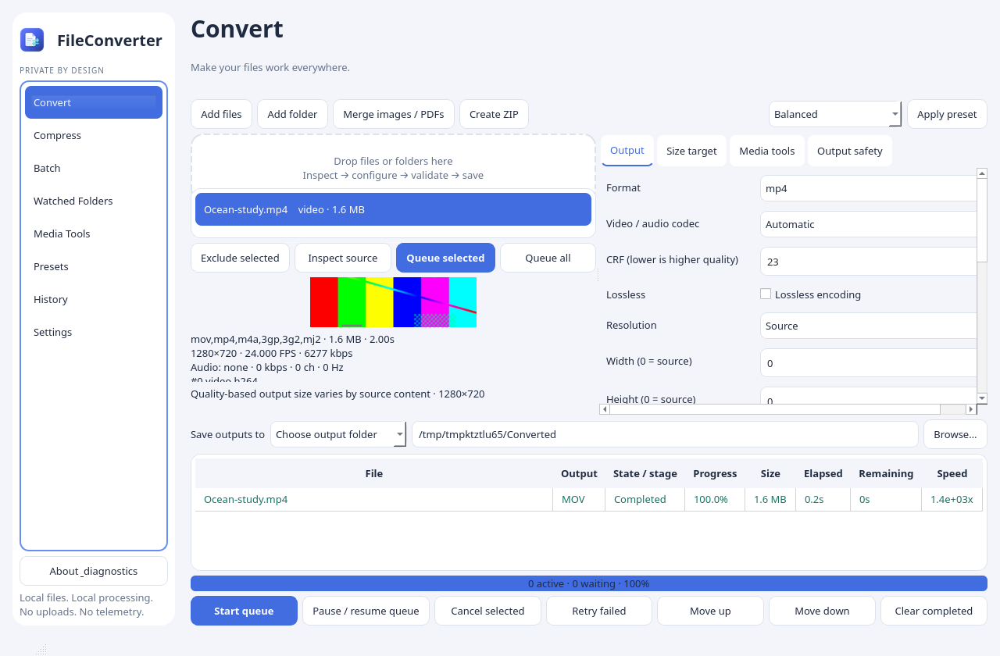
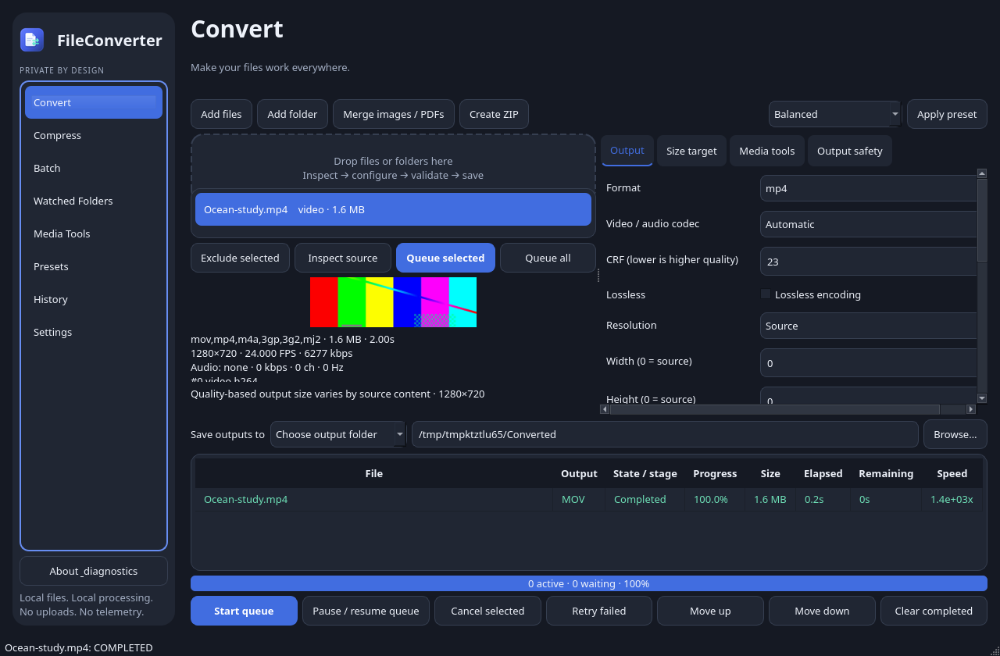

# FileConverter

A Windows-only local desktop converter and compressor with a Qt interface, real media
inspection, validated outputs, a durable queue and watched-folder automation.
Normal conversions never upload files. There is no telemetry or executable downloader.




Screenshots are captures of the actual application after a real MP4 → MOV remux.
The original application icon is in `assets/app.svg`, `app.png` and `app.ico`.

## Development

Python 3.11–3.13, FFmpeg/ffprobe on PATH and a desktop session are required.
LibreOffice is optional for Office documents. Install development tools once:

```powershell
py -3.12 -m venv .venv
.venv\Scripts\Activate.ps1
python -m pip install -e ".[dev]"
python -m fileconverter.app
```

```bash
python -m fileconverter.app --diagnostics
python -m pytest -q
python -m ruff check src scripts tests
python -m ruff format --check src scripts tests
python -m mypy src/fileconverter
python scripts/build.py --vendor vendor/windows-x64 --installer
```

`--data-dir PATH` isolates settings/history for testing. `--diagnostics` also writes
`dependency-report.json` in the application data directory, including for GUI-subsystem
Windows executables without a console. On headless Linux set `QT_QPA_PLATFORM=offscreen`
for the UI tests. Non-Windows source UI testing also requires
`FILECONVERTER_DEVELOPMENT=1`; production application and installer builds are Windows only. The mypy target platform is Windows;
POSIX-only process-tree termination is guarded at runtime.

## Workflow

Drop files or folders, or use Add files / Add folder. Folder discovery and inspection
run outside the UI thread. Unsupported/corrupt files are counted as skipped on import.
Select inputs to see actual container/codec metadata, then configure their output.
Queue selected files with one configuration, change settings and queue other files to
apply per-file settings, or queue all compatible inputs with shared settings. Choose
the **Save outputs to** selector: **Each file’s source folder** keeps every output
alongside its own input, even when a batch spans folders; **Choose output folder**
provides a Browse picker and editable absolute path. The chosen folder is remembered
when switching modes. Start queue begins work.
Pause stops dispatch while active encodes finish. Cancel terminates owned processes.
Interrupted jobs are preserved and can be retried, not resumed from partial encodings.

Double-click a job for its result and technical inspector. Open, Reveal, Copy path,
Repeat, diagnostics, history deletion and paginated history are available. Clearing
history does not delete files. Search covers stored history, with bounded page loading. Presets can be created, edited, duplicated, imported
and exported. Built-in preset identifiers are stable; duplicate one to rename it.
Service-size presets are editable convenience limits rather than claims about service
policies. ZIP compression streams arbitrary selected files or a recursive folder.
Merge images / PDFs creates a new validated PDF without overwriting an existing file.
ZIP and merge jobs use the normal persisted queue, cancellation and validated publication.
Output safety settings include a validated filename template with `{stem}`, `{suffix}`
and `{format}` fields; defaults preserve originals and automatically rename collisions.

Keyboard shortcuts: Ctrl+O files, Ctrl+Shift+O folder, Ctrl+Enter start queue,
Delete exclude/remove the selected item, Ctrl+, settings. Forms have accessible labels,
visible focus, standard Qt keyboard navigation, system/light/dark themes and virtualized
job tables. There are no decorative looping animations; reduced-motion users see the
same immediate, measured status updates.

## Conversion backends and limits

Capabilities are inspected from the installed FFmpeg encoders, decoders, muxers,
demuxers, filters and hardware methods. Discovered capabilities are intersected with
conservative container constraints. Encoder pixel formats and sample rates are queried.
Capabilities are cached by backend version, executable path, size and modification time.
Settings → Refresh capabilities updates dependency status after an installation change.
Encoder discovery does not prove a hardware device is usable; actual hardware failures
are diagnosed and retried with the compatible software encoder.

- **Video:** MP4, MOV, MKV, WebM, AVI, FLV, VOB, OGV, MPG/MPEG, TS/MTS/M2TS,
  M4V, 3GP and GIF when their required encoders/muxers are present. H.264, HEVC,
  VP8, VP9 and AV1 are available where compatible. GIFV is a web presentation
  convention, not an independent container. No fictional GIFV or MOGG encoder is exposed.
- **Audio:** MP3, M4A/AAC, FLAC, AIFF/AIF, OGG/OGA, Opus, WAV, WMA and AC3.
  Lossless codecs do not expose a meaningless lossy bitrate setting.
- **Images:** PNG, JPEG, WebP, GIF, BMP, TIFF, ICO and AVIF when Pillow can write them.
  EXIF orientation correction, crop, resize, rotate, quality, background flattening and
  removable metadata handling are implemented. Animated inputs are routed to FFmpeg,
  rather than silently flattened. Image processing is bounded by a 100-megapixel output
  limit and Pillow's decompression-bomb protections.
- **Documents:** image(s) → PDF; PDF → PNG/JPEG page folders, text, optimized PDF;
  text/Markdown/HTML → text, safe escaped HTML and paginated PDF. Markdown currently
  retains its text representation rather than emulating an Office layout. DOCX, ODT,
  RTF, TXT, HTML and spreadsheet CSV/XLSX conversions use detected LibreOffice.
  Office/text/PDF transformations can lose layout or structure and are not represented
  as lossless. PDF → editable DOCX is deliberately not advertised.

Media tools include trim, crop, resize, rotation, FPS, audio extraction/removal,
stream selection, text subtitle extraction/preservation/burning, individual frame/range
extraction, volume, loudness normalization, channel/sample-rate conversion, artwork and
metadata fields. Bitmap subtitles cannot be converted to text without OCR. Remux rejects
incompatible containers and requested edits. Lossy upconversion warns that a larger
bitrate cannot restore discarded information.

## Maximum-size compression

Decimal KB/MB/GB are used: 10 MB is 10,000,000 bytes. For a known duration:

```
video bitrate = floor(target bytes × 8 × 0.94 / duration − audio bitrate)
```

The planner budgets audio, reduces unrequested dimensions according to codec/bitrate/
source FPS, and uses two passes for supported software encoders. Other encoders use
bounded bitrate retries. Actual size is checked after encoding; oversize output is
never published. At most four attempts reduce bitrate using measured overshoot.
MP3 rates are constrained to valid encoder rates. Lossless audio is not offered with
a guaranteed maximum size. Images use a bounded quality search and require a smaller
resolution when even minimum quality cannot meet the target. Estimates are labelled;
quality-based encoding cannot predict exact size before inspecting content complexity.

## Watched folders

Each watcher has a path, recursion, AND/OR conditions, priority, named preset, output
mode, collision policy, source action, stability delay, startup and reconciliation
settings. Basic category/extensions/maximum audio bitrate fields are supplemented by a
validated advanced JSON rule editor for the full property model. Numeric values use
bytes, bits/second, seconds and pixels. For example:

```json
{"all":[
  {"field":"category","op":"eq","value":"audio"},
  {"field":"format","op":"eq","value":"mp3"},
  {"field":"audio_bitrate","op":"le","value":128000}
]}
```

The scheduler uses native watchdog events and periodic, asynchronous reconciliation.
It debounces events, checks stable size/mtime and readability, skips incomplete download
files, bounds candidate/event queues, and does not follow symlinks/junctions. Unchanged
files are not repeatedly probed. Missing folders are retained and monitoring reconnects.
New-files-only startup records an existing-file baseline; Scan now explicitly includes
it. Ask leaves existing files untouched until Scan now. Dry run uses the real detector,
matcher and planner without converting or moving files.

Source identity, preset/version, resulting output and state persist in SQLite. Generated
outputs and destination/archive subtrees are excluded. Highest-priority matching watcher
wins; ties use watcher ID. Named preset edits change the processing version and may
reevaluate unchanged sources. Lossy upconversion acknowledgement is invalidated by
relevant preset/rule changes. Failed inputs require explicit retry instead of indefinite
conversion loops. Keep original is the default. Archive, Recycle Bin and permanent
Delete require confirmation and occur only after successful output validation and a
source-identity recheck. Close-to-tray behavior requires the user's choice/configuration.

## Architecture

```
src/fileconverter/
  app.py           entry point, single-instance lock, local maintenance IPC
  ui.py            Qt screens, forms, asynchronous service bridge
  models.py        normalized options/job and legal state transitions
  store.py         SQLite WAL queue/history/presets/settings/activity/identities
  capabilities.py  dependency and encoder/container discovery
  detect.py        ffprobe, Pillow, PDF/Office inspection
  planner.py       deterministic conversion and compression plans/arguments
  process.py       cancellable owned subprocess trees, bounded diagnostics
  adapters.py      Pillow, PyMuPDF and isolated LibreOffice adapters
  engine.py        queue workers, disk checks, validation and publication
  watchers.py      rules, native events, stability, reconciliation, priority
  archive.py       streamed validated ZIP compression
assets/            original SVG/PNG/multi-resolution ICO
packaging/         Inno Setup maintenance installer and executable metadata
scripts/           native builds, icon rendering, screenshots, Windows verification
 tests/            unit, real conversion, watcher and Qt integration tests
```

Conversion state progresses QUEUED → INSPECTING → PLANNING → READY → PROCESSING →
VALIDATING → COMPLETED, with FAILED/CANCELLED/INTERRUPTED terminal states. The UI never
constructs FFmpeg commands. Workers have a maximum concurrency of four and software
encodes limit FFmpeg threads. Files are written in private destination-local temporary
directories; finalization prevents accidental clobbering. Media outputs are reopened and
fully decoded; images are decoded, document parsers reopen outputs, page counts are
checked, and size/stream/duration/resolution/codec requirements are validated.

## Windows distribution

See [build and release instructions](docs/BUILD.md) and
[dependency attributions](docs/ATTRIBUTIONS.md). Native Windows builds bundle Python,
Qt, image/PDF runtimes and a checksum-verified redistributable FFmpeg vendor bundle.
End users need no compiler, source checkout, Python or Node installation.
LibreOffice remains an optional separately installed backend.

The Inno Setup source registers Installed Apps, Start Menu and optional Desktop
shortcuts with the custom icon and application identity. Same-version maintenance
exposes Repair / Uninstall / Cancel. Repair restores shipped files, dependencies,
shortcuts and metadata while preserving user data. Uninstall keeps user data by default
and never targets converted output files. A local IPC close request stops watchers and
owned subprocesses before maintenance proceeds. Manual upgrades retain the same AppId.
No automatic updater or signing identity is configured.

## Privacy and troubleshooting

Settings/history live in `%LOCALAPPDATA%\FileConverter` on Windows, or
`$XDG_DATA_HOME/FileConverter` / `~/.local/share/FileConverter` elsewhere. SQLite stores
paths and technical properties, never source contents. Diagnostic logs rotate locally
at 2 MB with three backups. Copy/export diagnostics lists dependency versions and
system information; technical job details are available separately. Reports include
local paths, so review them before sharing.

If media controls are unavailable, inspect Dependencies, install trusted FFmpeg/ffprobe
on PATH for development, or repair the packaged application. Office conversions need
LibreOffice; its version is shown in settings. A fresh per-job Office profile disables
macros and automatic link updates. The app is not a security sandbox for hostile native
codec/document parsers: keep dependencies current and use OS isolation for untrusted files.

If a target is infeasible, trim or resize, reduce audio bitrate or increase the maximum.
Permission/disk errors preserve originals and discard unpublished temporary outputs.
After an interrupted application exit, retry interrupted jobs; partial output is never
assumed valid. Missing/removable/network watch roots show Waiting for folder. Native
notification availability depends on OS tray/notification configuration.

## Verification

See [the verification report](docs/VERIFICATION.md) for the checks actually executed.
The 1.0.4 Windows release was actually built and tested on a native Windows runner:
install, upgrade, missing/corrupt-file and metadata repair, uninstall/reinstall,
user-data preservation, real conversions, size limits, custom executable icons and
three native UI tests passed. The downloadable ZIP includes Setup, the app/runtime,
engines, full source and verification reports. Visual DPI/accessibility/notification
behavior and interrupted-install scenarios still need interactive review. The installer
is unsigned; no publisher certificate is configured.


## Windows ZIP release

The Windows release ZIP contains the actual Setup executable, the bundled application
and conversion engines, complete project source, documentation and license notices.
Run Setup to install. Run the same-version Setup again for Repair / Uninstall / Cancel.
Installed Apps also provides normal uninstall. An explicit source-folder output choice
protects originals by retaining the conversion suffix and safe collision behavior.

`.github/workflows/windows-release.yml` builds on a native Windows runner, including
FFmpeg 7.1.5, x264, LAME and zlib from pinned upstream source commits. The complete
corresponding engine source is bundled. This baseline includes software H.264, AAC,
MP3, FLAC, PCM, GIF and PNG capabilities; optional encoders such as HEVC, VP9, AV1 or
hardware encoders are exposed only when present in a different audited FFmpeg bundle.
Publishing a `v*` tag runs native build, install, repair, uninstall, reinstall and
real conversion/maximum-size smoke checks before creating a GitHub release ZIP.
GitHub Actions failures prevent publication. Signing remains a publisher responsibility;
this project's automated build does not invent a signing certificate.

To package just the complete project source on any development host:
`python scripts/release_zip.py --source-only`. This source ZIP is explicitly distinct
from the Windows ZIP containing an actual built installer.

Download the verified Windows bundle: https://github.com/frankintheocean/FileConverter/releases/download/v1.0.4/FileConverter-1.0.4-Windows-x64.zip
